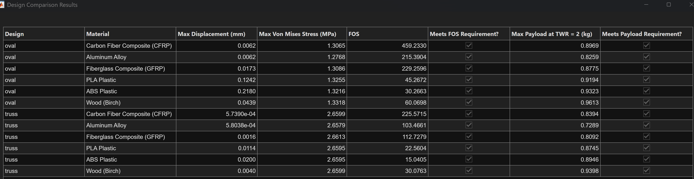

# Solution to Classroom Challenge Project Drone Payload Capacity and Structural Design Analysis

# Project Details

In this project, a drone arm was designed and analyzed by calculating the maximum stress of the arm using the given factor of safety, and conducting Finite Element Analysis. In designing the arm, our team first brainstormed simple shapes that could be used. After those shapes were sketched, and their area, volume and density equations were inputed into a MATLAB code, dimensions were approximated before they were sketched and completed in a CAD software. This allowed us to pick dimensions for each arm that would set it below our factor of safety for stress in the arm. Finite element analysis would be completed after the shapes were sketched and design in a CAD software. The two shapes that our team decided to use in this project are a hollow, oval shaped arm, and a truss inspired arm. 

After completed a MATLAB code to run a stress analysis and finite element analysis on each arm design, the two were compared to determine which design best met the requirements, and fell below the given factor of safety. Some of the factors that were considered when determining which design had the best results included which one had a better margin of error in terms of the given factor of safety. The finite element analysis was also used to determine which arm design had less strain and deformation. These results can be seen in the graph and data below.

# Project Solution Instructions

1. Place the closed STL or STEP files for each drone-arm design in the `cad` folder.

2. Open `DroneDesign_StudentProjectTemplate.mlx` in MATLAB.

3. Update the `filePaths` string array so that it contains the relative path to each CAD file.

4. Update the `designNames` string array so that each design name corresponds to the CAD file in the same array position.

5. Update the `areas` array using units of square meters. In the current implementation, each value represents the surface area of one loaded face. The code assumes that all loaded faces selected for a design have equal areas.

6. Run Task 1 to load the material properties and initialize the project parameters.

7. Run Task 3 to calculate the volume, arm mass, and maximum payload for each design and material combination.

8. Run the first portion of Task 4 containing `designVisualizer(filePaths)`. Use the displayed face labels to identify the attachment and load surfaces on each model.

9. Update `fixedFaces` with the face IDs of the surfaces attached to the drone body.

10. Update `loadedFaces` with the face IDs of the surfaces where the motor loads are applied.

11. Run the remainder of Task 4 to perform the finite element analyses, generate the displacement and von Mises stress plots, calculate the factor of safety, and create the final results table.

12. Review the results and confirm that the selected design:

* supports a payload of at least 0.5 kg,
* maintains a thrust-to-weight ratio of at least 2:1, and
* has a factor of safety of at least 1.5.

# Results
Add a picture, plot, animation, GIF, or table to demonstrate the expected result or output of your project solution.

# Contact (optional)
raynittacillo@gmail.com