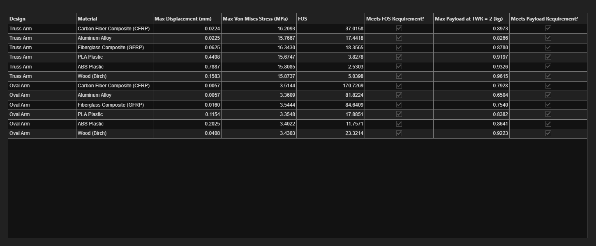
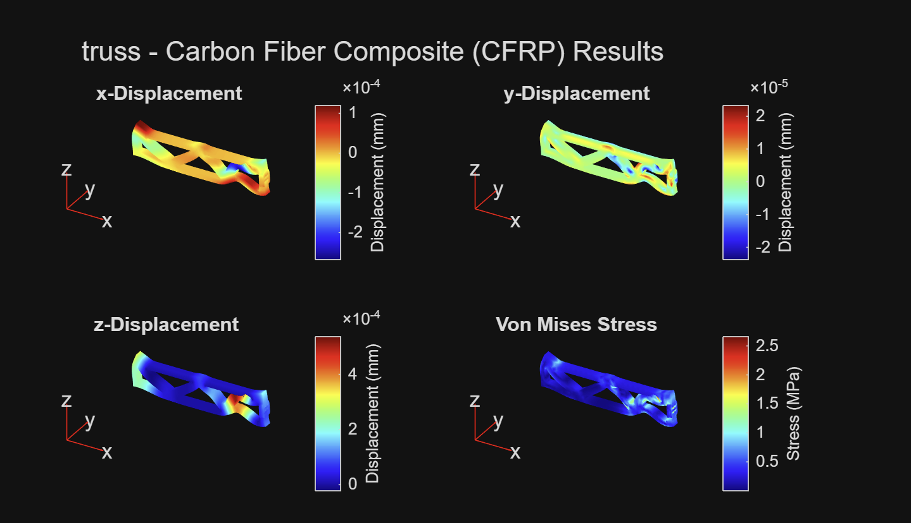
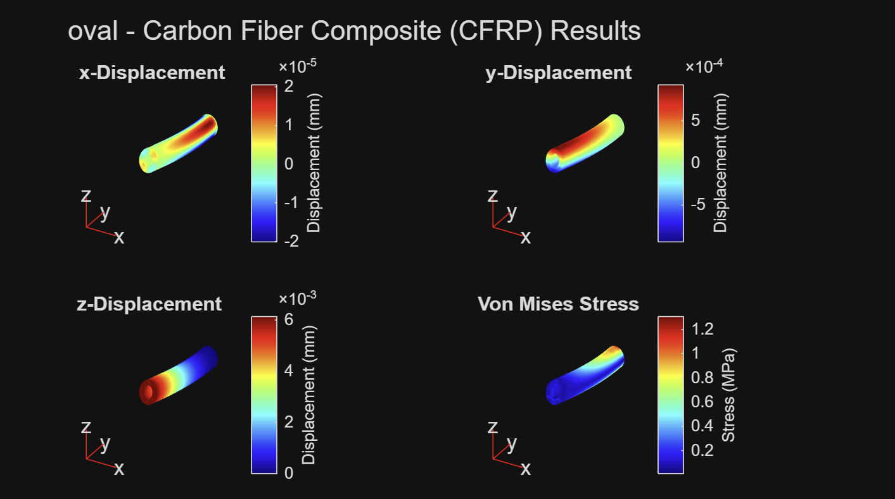

# Solution to Classroom Challenge Project Drone Payload Capacity and Structural Design Analysis

# Team
Ray Cillo (UCLA) - Project Manager, Quality Assurance

Angel Hernandez (Cal Poly SLO) - Documentation, Visualization & FEA Lead

Aadesh Bamane (SDSU) - Modeling Lead

Angelina Mikhaiel (SDSU) - Analysis/Validation Lead

# Project Details
In this project, a drone arm was designed and analyzed by calculating the maximum stress of the arm, performing a thrust-to-weight analysis to determine payload capacity, and conducting Finite Element Analysis. In designing the arm, our team first brainstormed simple shapes that could be used. After those shapes were sketched, their area, volume, and density equations were inputted into a MATLAB code, and dimensions were approximated before they were sketched and completed in a CAD software. This allowed us to pick dimensions for each arm that would keep it above our minimum factor of safety of 1.5 while still meeting the 0.5 kg minimum payload and 2:1 thrust-to-weight requirements. Finite element analysis would be completed after the shapes were sketched and designed in a CAD software. The two shapes that our team decided to use in this project are a hollow, oval shaped arm, and a truss inspired arm.

Our first set of dimensions came from the approximate MATLAB calculations, but the finite element analysis showed that those designs did not hold up. The oval arm deformed more than we wanted, and the truss arm fell below the minimum factor of safety for half of the material options, mostly because of stress concentrations at the joints and mounting holes that our simpler equations could not account for. We revised both designs with thicker walls and wider truss members, which fixed both problems but added mass and reduced how much payload the drone could carry.

After completing a MATLAB code to run a stress analysis and finite element analysis on each arm design, the two were compared to determine which design best met the requirements and stayed above the minimum factor of safety. Some of the factors that were considered when determining which design had the best results included which one had a better margin above the required factor of safety, and which one had the higher maximum payload capacity. The finite element analysis was also used to determine which arm design had less stress and displacement. These results can be seen in the graph and data below.

# Project Solution Instructions

**Requirements:** MATLAB R2023b or later with the Partial Differential Equation Toolbox.

1. Place the closed STL or STEP files for each drone-arm design in the `cad` folder.
2. Open `DroneDesign_StudentProjectTemplate.mlx` in MATLAB.
3. Update the `filePaths` string array so that it contains the relative path to each CAD file.
4. Update the `designNames` string array so that each design name corresponds to the CAD file in the same array position.
5. Update the `areas` array using units of square meters. In the current implementation, each value represents the surface area of one loaded face. The code assumes that all loaded faces selected for a design have equal areas, and the function multiplies this value by the number of selected loaded faces.
6. Run Task 1 to load the material properties and initialize the project parameters.
7. Run Task 3 to calculate the volume, arm mass, and maximum payload for each design and material combination.
8. Run the first portion of Task 4 containing `designVisualizer(filePaths)`. Use the displayed face labels to identify the attachment and load surfaces on each model.
9. Update `fixedFaces` with the face IDs of the surfaces attached to the drone body.
10. Update `loadedFaces` with the face IDs of the surfaces where the motor loads are applied.
11. Run the remainder of Task 4 to perform the finite element analyses, generate the displacement and von Mises stress plots, calculate the factor of safety, and create the final results table.
12. Review the results and confirm that the selected design:
* supports a payload of at least 0.5 kg,
* maintains a thrust-to-weight ratio of at least 2:1, and
* has a factor of safety of at least 1.5.
# Results
## Summary of Payload and FEA Results

## Carbon Fiber Composite Planar Truss: Displacement and Von Mises Stress

## Carbon Fiber Composite Hollow Oval Arm: Displacement and Von Mises Stress

# Final Recommendation

The recommended design is the planar truss arm made from carbon fiber composite. This combination supports a maximum payload of 0.8973 kg while limiting maximum displacement to approximately 0.0224 mm and maintaining a factor of safety above the required minimum of 1.5.

Although several lower-density materials provided slightly higher maximum payload capacities, they also experienced greater displacement. The carbon fiber truss therefore provided the best overall balance between payload capacity, stiffness, mass efficiency, and structural safety.
# Contact
raynittacillo@gmail.com